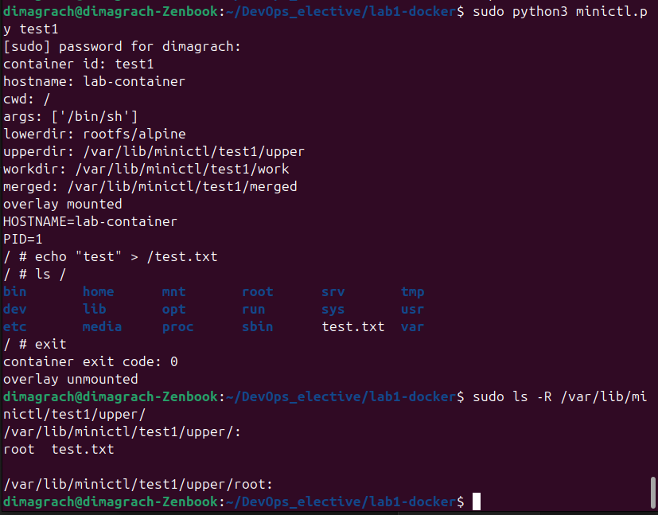

# Лабораторная работа №1 - Docker (advanced)

Для начала я подготовил окружение - создал директорию `mini-oci` и скачал `Alpine rootfs`

После этого я создал файл `config.json`


```
{
  "ociVersion": "1.0.2",
  "hostname": "lab-container",
  "process": {
    "cwd": "/",
    "args": ["/bin/sh"]
  }
}
```

Далее перешел к созданию утилиты на python, выполняющую следующие задачи:
1) чтение `config.json`
2) создание директорий контейнера
3) настройка `overlays`
4) запуск в изолированных namespaces
5) выполнение команды внутри контейнера

Для контейнера `<id>` создается:
``/var/lib/minictl/<id>``

Каталоги:
```
    upper = container_dir / "upper"
    work = container_dir / "work"
    merged = container_dir / "merged"
    lower = "~/mini-oci/rootfs/alpine"
```


## Тестирование

