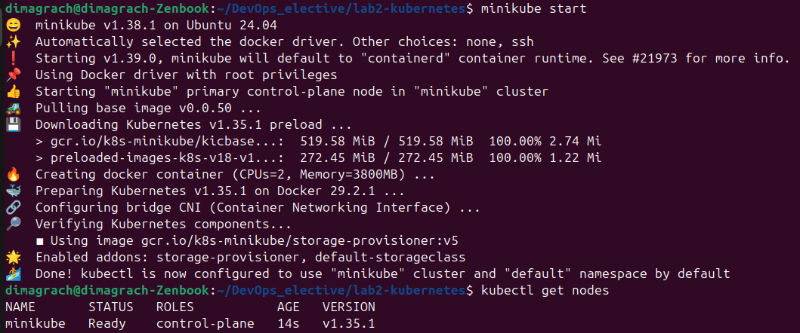
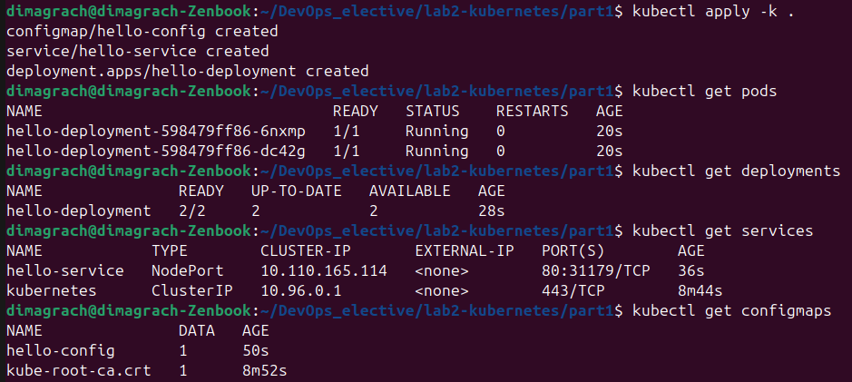
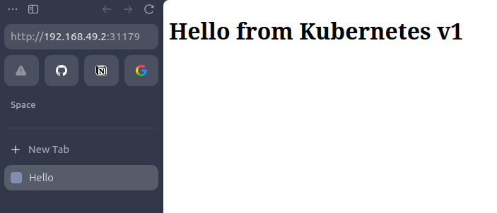
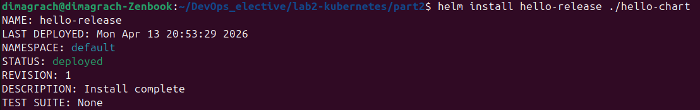
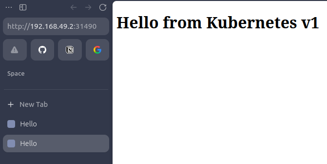
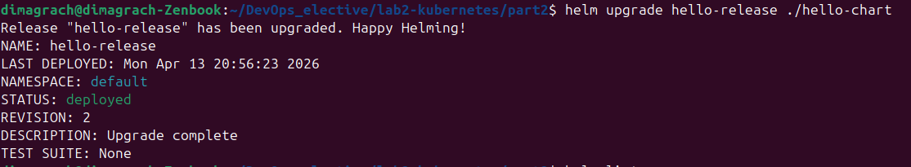
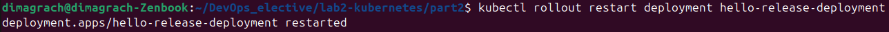
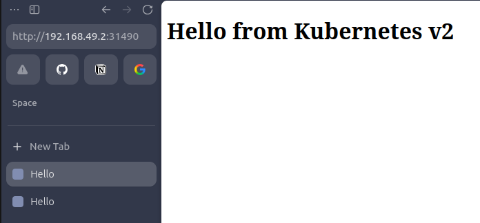

# Лабораторная работа №2 - Kubernetes (базовый трек)

## 1 часть

Для начала я установил kubectl и minicube.
После этого я запустил кластер с помощью команды `minicube start` и проверил статус

Далее я создал 4 файла в папке `part1`:
- configmap.yaml -- хранит конфигурационные данные приложения
- deployment.yaml -- описывает, как должно быть запущено приложение в Kubernetes
- service.yaml -- создает сетевой доступ к приложению внутри кластера и снаружи
- kustomization.yaml -- объединяет несколько .yaml манифестов в один набор для удобного запуска одной командой

После этого я запустил развертывание сервиса в kubernetes с помощью команды `kubectl apply -k .` и проверил созданные ресурсы

И в конце для провери работы сервиса в браузере я воспользовался командой `minikube service hello-service` и вот результат

## 2 Часть

Для второй части я устновил helm. Создал папку `part2`, в которой создал необходимые файлы для создания helm chart:
- Chart.yaml
- values.yaml
- template/configmap.yaml
- template/deployment.yaml
- template/service.yaml

После этого я установил приложение в кластер с помощью команды `helm install hello-release ./hello-chart`

Открыл адрес приложения в браузере

После этого я отредактировал текст и выполнил upgrade релиза. Проверил содержимое страницы в браузере

## 3 причины, по которым использовать хелм удобнее чем классический деплой через кубернетис манифесты

1) **Параметризация конфигурации**: helm позволяет выносить изменяемые параметры в файл values.yaml. Благодаря этому один и тот же чарт можно испльзовать для различных конфигураций приложения безе редактирования всех .yaml файлов вручную
2) **Удобное обновление приложения**: с помощью команды `helm upgrade` можно быстро обновлять приложение. Это удобнее, чем повторно применять множество отдельных манифестов
3) **Управление приложением как единым релизом**: helm объединяет набор kubernetes ресурсов в одну логическую сущность - релиз. Это упрощает установку, обновление и удаление приложения
