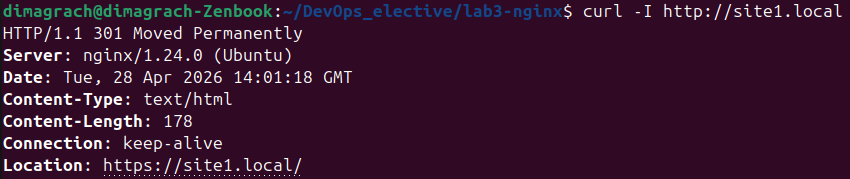
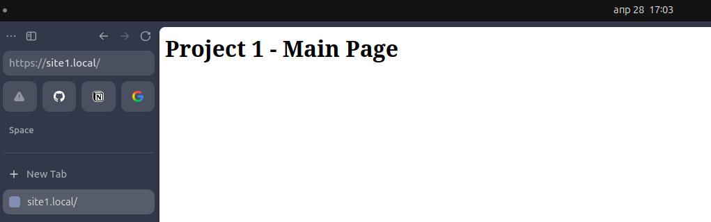
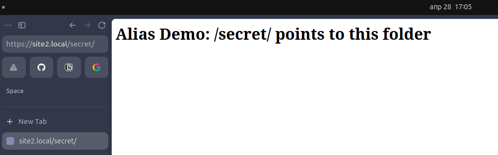
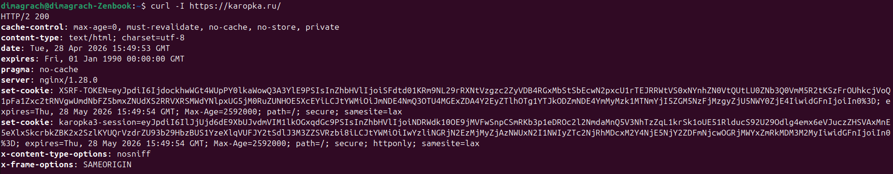
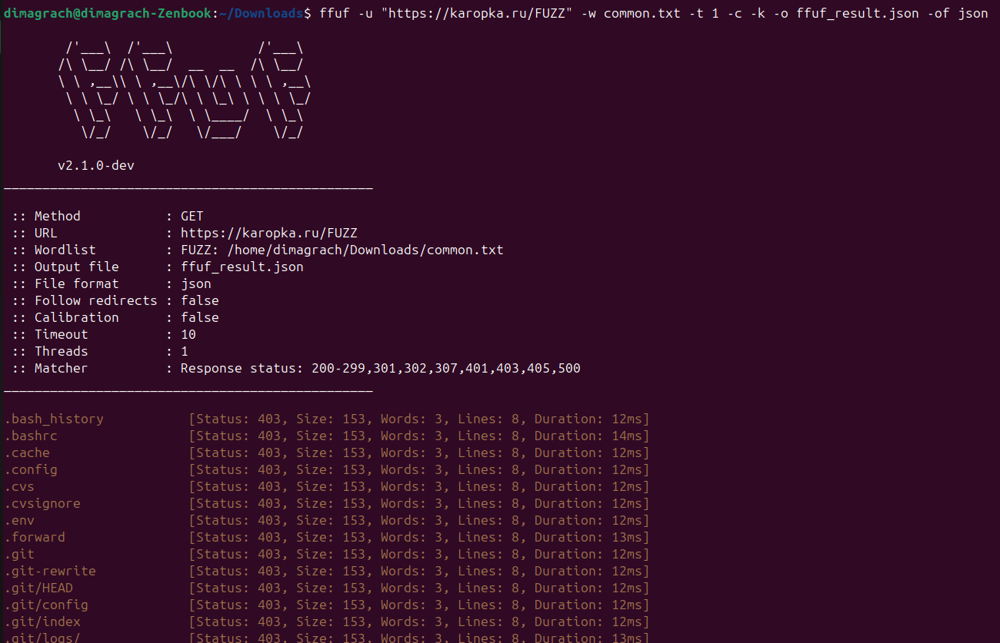
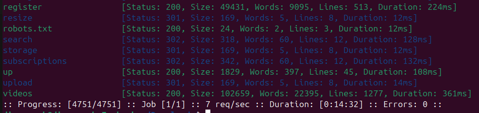
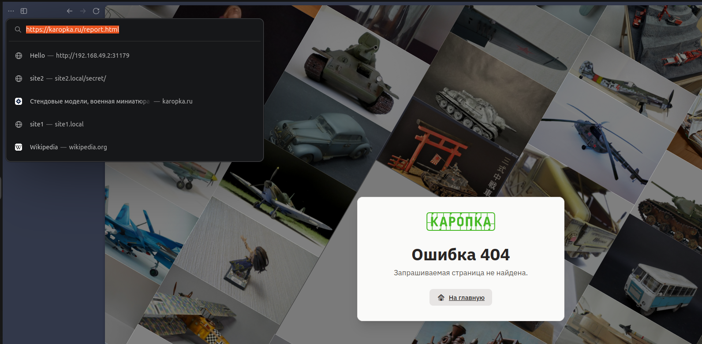
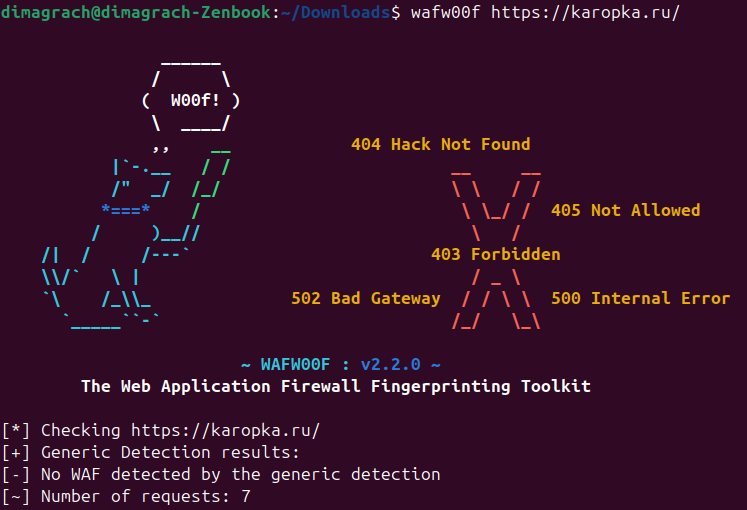
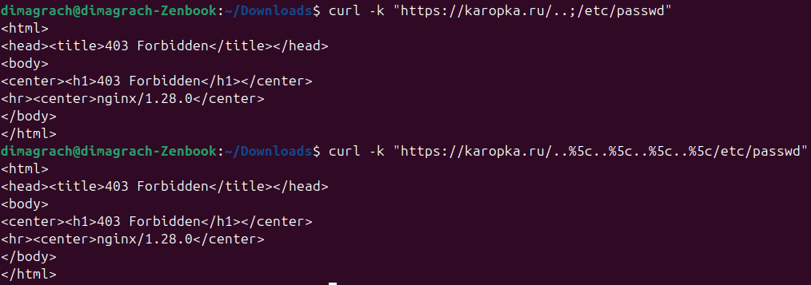

# Лабораторная работа №3 - nginx (базовый трек)

## 1 часть

Для начала я установил nginx.
После этого я создал структуру своих проектов - директории `/var/www/lab3/project1`, `/var/www/lab3/project2` и `/var/www/lab3/alias_demo`. В каждой директории создал `index.html`.

Затем я создал ssl-сертификаты
```
sudo mkdir -p /etc/nginx/ssl

sudo openssl req -x509 -nodes -days 365 -newkey rsa:2048 \
  -keyout /etc/nginx/ssl/site1.local.key \
  -out /etc/nginx/ssl/site1.local.crt \
  -subj "/CN=site1.local"

sudo openssl req -x509 -nodes -days 365 -newkey rsa:2048 \
  -keyout /etc/nginx/ssl/site2.local.key \
  -out /etc/nginx/ssl/site2.local.crt \
  -subj "/CN=site2.local"
```

Далее я настроил конфиг:
```
server {
    listen 80;
    listen [::]:80;
    server_name site1.local site2.local;
    return 301 https://$host$request_uri;
}

server {
    listen 443 ssl;
    listen [::]:443 ssl;
    server_name site1.local;

    ssl_certificate /etc/nginx/ssl/site1.local.crt;
    ssl_certificate_key /etc/nginx/ssl/site1.local.key;

    root /var/www/lab3/project1;
    index index.html;

    location / {
        try_files $uri $uri/ =404;
    }
}

server {
    listen 443 ssl;
    listen [::]:443 ssl;
    server_name site2.local;

    ssl_certificate /etc/nginx/ssl/site2.local.crt;
    ssl_certificate_key /etc/nginx/ssl/site2.local.key;

    root /var/www/lab3/project2;
    index index.html;

    location / {
        try_files $uri $uri/ =404;
    }

    location /secret/ {
        alias /var/www/lab3/alias_demo/;
        index index.html;
    }
}
```

Проверил работоспособность:
1) Редирект http - https


2) Доступ к project1 


3) Доступ к project2


4) Проверка работы alias


## 2 Часть

В качестве подопытного я выбрал сайт https://karopka.ru/ - небольшой сайт любителей масшатабных моделей из пластика.

С этим же сайтом работали мои тиммейты, во время выполнения этой же лабы осенью этого года в рамках дисциплиниы "Облачные технологии и услуги". 

Я увидел, что с того момента сайт полностью поменяли. Вышла версия 3.0. Так что мне стало интересно проверить, изменилось ли что то в плане безопасности.

### 1) ffuf

Как и мои коллеги полгода назад, я начал проверку с обычного `curl`


Стало понятно, что сайт был серьезно переписан. Разработчики перешли с Bitrix на Laravel, что сильно повысило защищенность сайта благодаря встроенной защите от CSRF, XSS и SQL-инъекций. Добавили Content-Security-Policy и X-Content-Type-Options: nosniff. Плюс сокрыли служебную информацию: версию PHP и прямое указание CMS. Сделали более безопасные куки.

Однако версию nginx так и не скрыли. Так что злоумышленник сможет искать эксплойты именно под эту версию.

Дальше я взял файл common.txt из этой репо и запустил ffuf



Большинство запросов вернули коды 403, 301 и 302. Те запросы, которые вернули статус 200 - это базовые общедоступные разделы сайта. Отдельно я проверил адрес https://karopka.ru/report.html, по которому в прошлый раз получилось увидеть дашборд, не предназначенный для обычных пользователей, но теперь по этому адресу показывается заглушка, что страница не найдена


Вывод: разработчики исправили старые уязвимости и не добавили очевидных новых.

### 2) WAF защита

Далее я установил wafw00f и запустил проверку. Сайт все также не использует waf-правила, ограничиваясь настройками nginx и Laravel


### 3) Path traversal

Проверил три пути:
```
# Попытка прочитать /etc/passwd
curl -k "https://karopka.ru/../../../../etc/passwd"
curl -k "https://karopka.ru/..;/etc/passwd"
curl -k "https://karopka.ru/..%5c..%5c..%5c..%5c/etc/passwd"
``` 

Первый вернул статус 200, но при этом это он вернул страницу "Страница не найдена". Остальные два запроса вернули статус 403.


### Вывод
За полгода сайт прошел глубокую модернизацию безопасности: смена CMS, исправление известных уязвимостей, внедрение защитных заголовков и правильная обработка path traversal. Уровень защиты значительно повышен.
