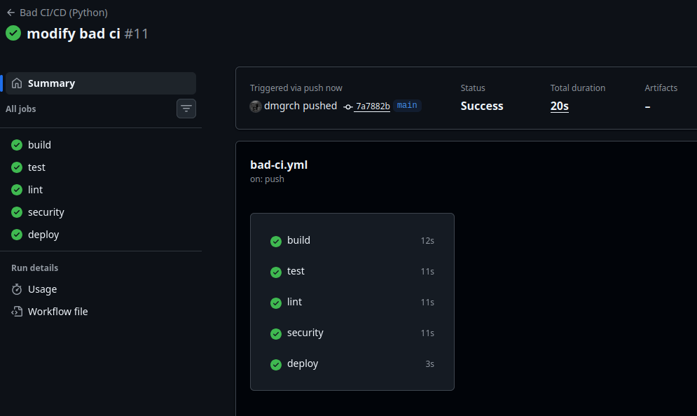
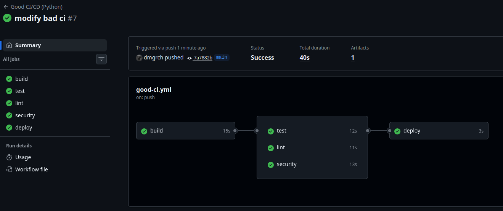
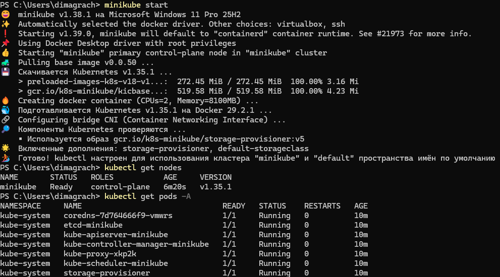
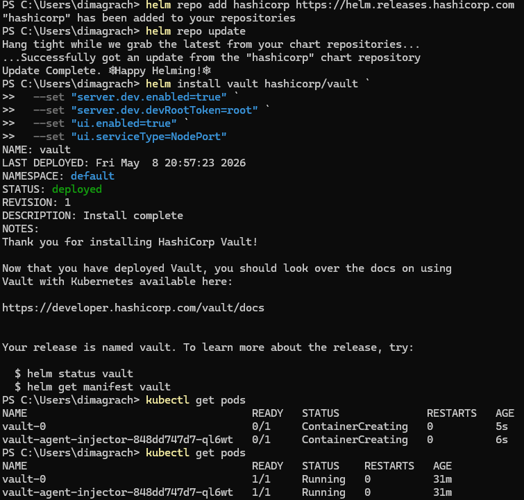
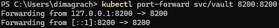
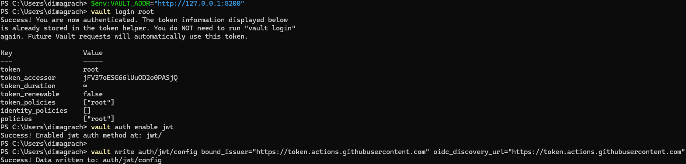
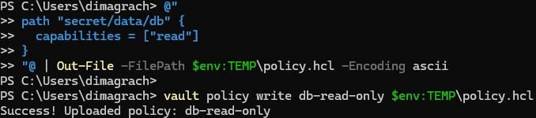
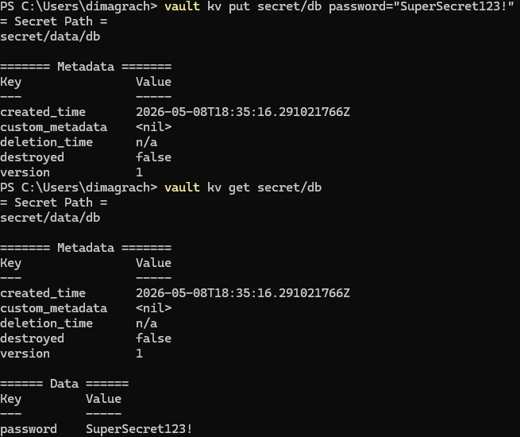
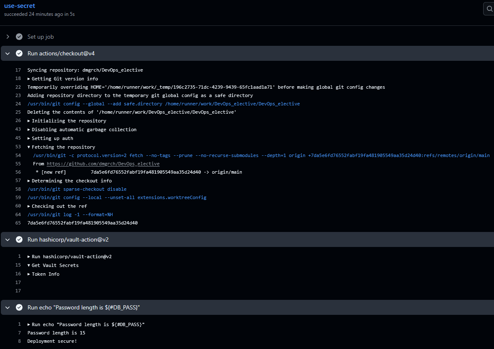

# Лабораторная работа №4 - CI/CD (базовый трек)

## 1 часть
### Bad CI/CD файл
```
name: Bad CI/CD (Python)

on: [push]

jobs:
  build:
    runs-on: ubuntu-latest
    defaults:
      run:
        working-directory: ./lab4-ci-cd
    steps:
      - uses: actions/checkout@v4
      - uses: actions/setup-python@v5
        with:
          python-version: '3.x'
      - name: Install dependencies
        run: pip install -r requirements.txt
      - name: Build check
        run: python -c "print('Build OK')"

  test:
    runs-on: ubuntu-latest
    defaults:
      run:
        working-directory: ./lab4-ci-cd
    steps:
      - uses: actions/checkout@v4
      - uses: actions/setup-python@v5
        with:
          python-version: '3.x'
      - run: pip install -r requirements.txt
      - name: Run tests (errors hidden)
        run: pytest || true

  lint:
    runs-on: ubuntu-latest
    defaults:
      run:
        working-directory: ./lab4-ci-cd
    steps:
      - uses: actions/checkout@v4
      - uses: actions/setup-python@v5
        with:
          python-version: '3.x'
      - run: pip install -r requirements.txt
      - name: Lint (errors hidden)
        run: flake8 . || true

  security:
    runs-on: ubuntu-latest
    defaults:
      run:
        working-directory: ./lab4-ci-cd
    steps:
      - uses: actions/checkout@v4
      - uses: actions/setup-python@v5
        with:
          python-version: '3.x'
      - run: pip install -r requirements.txt
      - name: Security check (errors hidden)
        run: bandit -r . || true

  deploy:
    runs-on: ubuntu-latest
    env:
      DB_PASSWORD: "supersecret123"
    steps:
      - name: Deploy (potential leak)
        run: echo "Deploying ..."
```

### Good CI/CD файл
```
name: Good CI/CD (Python)

on:
  push:
    branches: [main, develop]
  pull_request:
    branches: [main]

jobs:
  build:
    runs-on: ubuntu-22.04
    timeout-minutes: 5
    defaults:
      run:
        working-directory: ./lab4-ci-cd
    steps:
      - uses: actions/checkout@v4
      - uses: actions/setup-python@v5
        with:
          python-version: '3.10'
          cache: 'pip'
      - name: Install dependencies
        run: pip install -r requirements.txt
      - name: Build check
        run: python -c "print('Build OK')"
      - name: Upload source
        uses: actions/upload-artifact@v4
        with:
          name: lab4-source
          path: lab4-ci-cd/

  test:
    runs-on: ubuntu-22.04
    needs: build
    timeout-minutes: 5
    defaults:
      run:
        working-directory: ./lab4-ci-cd
    steps:
      - uses: actions/checkout@v4
      - uses: actions/setup-python@v5
        with:
          python-version: '3.10'
          cache: 'pip'
      - run: pip install -r requirements.txt
      - name: Run tests
        run: pytest

  lint:
    runs-on: ubuntu-22.04
    needs: build
    timeout-minutes: 5
    defaults:
      run:
        working-directory: ./lab4-ci-cd
    steps:
      - uses: actions/checkout@v4
      - uses: actions/setup-python@v5
        with:
          python-version: '3.10'
          cache: 'pip'
      - run: pip install -r requirements.txt
      - name: Lint
        run: flake8 .

  security:
    runs-on: ubuntu-22.04
    needs: build
    timeout-minutes: 5
    defaults:
      run:
        working-directory: ./lab4-ci-cd
    steps:
      - uses: actions/checkout@v4
      - uses: actions/setup-python@v5
        with:
          python-version: '3.10'
          cache: 'pip'
      - run: pip install -r requirements.txt
      - name: Security audit
        run: bandit -r .
    continue-on-error: true

  deploy:
    runs-on: ubuntu-22.04
    needs: [test, lint, security]
    timeout-minutes: 10
    environment: production
    steps:
      - name: Deploy
        run: echo "Deploying to production..."
```

### Плохие практики и их исправления

#### 1. Хардкод секретных данных
**Проблема:** переменная `DB_PASSWORD: "supersecret123"` задана прямо в workflow.  
**Почему плохо:** любой человек с доступом к репозиторию видит пароль. При утечке кода или логов пароль скомпрометирован.  
**Исправление:** в хорошем файле секреты хранятся в GitHub Secrets и передаются через `${{ secrets.DB_PASSWORD }}`, а в логах не отображаются.
**Эффект:** исключена утечка конфиденциальной информации.

#### 2. Плавающие версии окружений
**Проблема:** `runs-on: ubuntu-latest` и `python-version: '3.x'`.  
**Почему плохо:** сборка не является воспроизводимой. При обновлении образа ОС или минорной версии Python пайплайн может сломаться неожиданно.  
**Исправление:** указаны конкретные версии `ubuntu-22.04` и `python-version: '3.10'`.
**Эффект:** окружение стабильно и предсказуемо в любое время.  

#### 3. Отсутствие кэширования зависимостей
**Проблема:** в каждой джобе выполняется `pip install -r requirements.txt` без кэша.  
**Почему плохо:** каждый запуск заново скачивает пакеты, что замедляет пайплайн и создаёт лишнюю нагрузку на PyPI.  
**Исправление:** добавлено `cache: 'pip'` в `actions/setup-python`, что автоматически кэширует установленные пакеты.
**Эффект:** скорость прохождения пайплайна существенно возрастает.

#### 4. Подавление ошибок (`|| true`)
**Проблема:** команды `pytest || true`, `flake8 . || true`, `bandit -r . || true`.  
**Почему плохо:** даже если тесты падают, линтер находит ошибки или bandit обнаруживает уязвимости, пайплайн всё равно помечается успешным. Проблемы остаются незамеченными и попадают в production.  
**Исправление:** в хорошем файле все проверки выполняются без подавления ошибок. Уязвимости (`bandit`) по-прежнему разрешено не блокировать деплой через `continue-on-error: true`, чтобы видеть предупреждения, но не стопорить релиз.
**Эффект:** пайплайн честно сообщает о проблемах, вынуждая разработчиков их исправлять до деплоя.

#### 5. Отсутствие зависимостей между джобами
**Проблема:** все джобы `build`, `test`, `lint`, `security`, `deploy` запускаются параллельно, не дожидаясь успеха друг друга.  
**Почему плохо:** деплой может начаться раньше, чем завершатся тесты; тесты и линтинг могут тратить ресурсы на код, который не собирается. Нет логического порядка.  
**Исправление:** джобы `test`, `lint`, `security` теперь зависят от `build` (через `needs: build`), а `deploy` – от всех трёх проверок (`needs: [test, lint, security]`).
**Эффект:** пайплайн выполняется в правильной логической последовательности.

#### 6. Запуск на каждое изменение
**Проблема:** `on: [push]` – пайплайн стартует при любом пуше во все ветки.  
**Почему плохо:** бесполезная трата ресурсов на черновые и экспериментальные ветки, где код ещё не готов.  
**Исправление:** хороший файл ограничивается только push в `main`/`develop` и pull request в `main`.
**Эффект:** экономия квот GitHub Actions, запуски только для значимых изменений.


### Работоспособность CI/CD файлов




## 2 Часть

В этой части я работал с Vault.

После неудачных попыток настроить `HashiCorp Vault` через их сайт и с помощью `Docker`, я решил воспользоваться недавно полученными знаниями по куберу.

Запустил кластер с помощью `minikube`:


Потом я установил `Vault` через `Helm`:


И пробросил порт:


Далее я перешел к настройке `Vault`. Залогинился, включил JWT и настроил OIDC:


Создал новую политику и роль:



Записал секрет для теста и проверил его через Vault:



После этого я перешел к проверке работоспособности через CI/CD пайплайн и GitHub Actions. Для этого я сначала запустил туннель через `localhost.run`. Потом создал новый .yml файл – `vault-test.yml`. Запушил его на гитхаб и вручную через Actions запустил этот workflow:



В итоге workflow успешно выполнился без ошибок, секрет был получен из Vault. Пароль был прочитан, но в логах можно увидеть только `Password length is 15` (как раз размер моего пароля `SuperSecret123!`), но сам пароль не был засвечен. Соответсвенно, можно сказать, что вторая часть работы была выполнена успешно.

### Почему хранение секретов в CI/CD переменных репозитория – не лучшая практика

Хранение секретов в CI/CD переменных репозитория не является лучшей практикой, потому что такие секреты обычно статичны, долго живут и привязаны к конкретному репозиторию, из-за чего при ошибке в настройке workflow, утечке логов или компрометации доступа к репозиторию они могут быть раскрыты. Более безопасный подход — использовать отдельное хранилище секретов, например `HashiCorp Vault`, который я использовал в этой лабе: pipeline получает секрет только во время выполнения, а доступы, аудит и ротация управляются централизованно.


