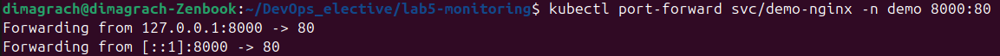
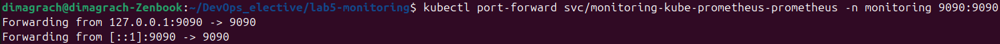
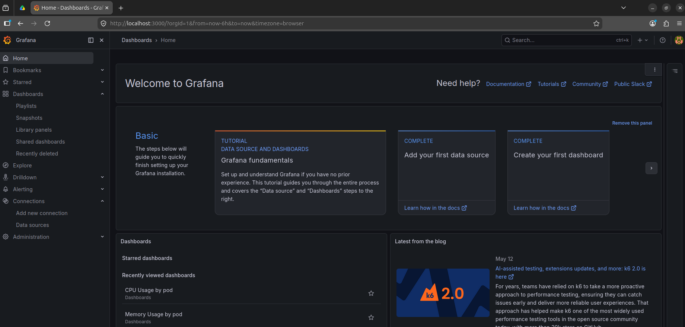
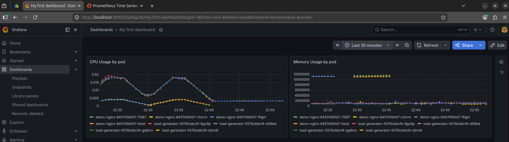
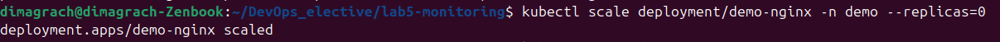
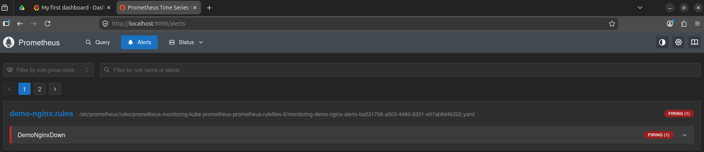

# Лабораторная работа №5 - Мониторинг (базовый трек)

## 1 часть
Для выполнения лабы развернул kubenetes-кластер с помощью `minikube`.В кластере создал namespace `demo`, в котором запустил тестовый сервис `demo-nginx`

Работоспособность сервиса проверил через проброс порта



Для создания нагрузки добавил 5 экземпляров deployment `load-generator`, который отправлял HTTP-запросы к сервису `demo-nginx`

Для мониторинга установил kube-prometheus-stack, включающий Prometheus и Grafana

После этого открыл графану через проброс порта


Ввел логин и пароль и попал в графану


После этого я создал дашборд с двумя графиками - CPU Usage by pod и Memory Usage by pod, которые показывают использование CPU и оперативной памяти подами в namespace `demo`


## 2 Часть
Для начала я создал алерт в виде кубер-манифеста 

```
apiVersion: monitoring.coreos.com/v1
kind: PrometheusRule
metadata:
  name: demo-nginx-alerts
  namespace: monitoring
  labels:
    release: monitoring
spec:
  groups:
    - name: demo-nginx.rules
      rules:
        - alert: DemoNginxDown
          expr: kube_deployment_status_replicas_available{namespace="demo", deployment="demo-nginx"} < 1
          for: 30s
          labels:
            severity: critical
          annotations:
            summary: "demo-nginx is down"
            description: "Deployment demo-nginx has no available replicas in namespace demo."
```

Алерт срабатывал тогда, когда у deployment `demo-nginx` в namespace `demo` не оставалость доступных реплик

Так, для проверки работоспособности алерта я уменьшил количество реплик `demo-nginx` до 0:


После этого алерт перешел в состояние Firing в прометеусе


Также я попробовал настроить отправку уведомлений в телеграм через Alertmanager, но после всех попыток настройки сообщение так и не пришло. Возможно, это связано с тем, что к телеграму без vpn нет доступа...
